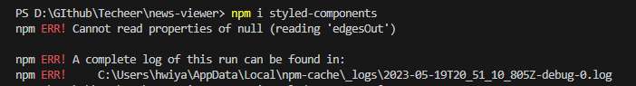
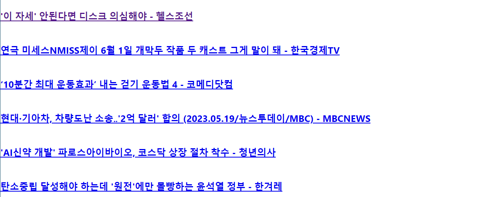
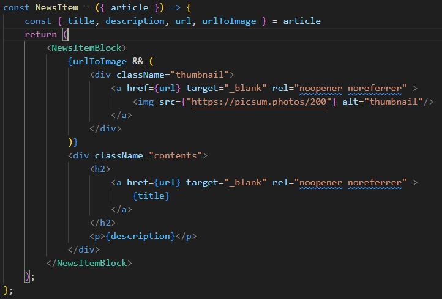
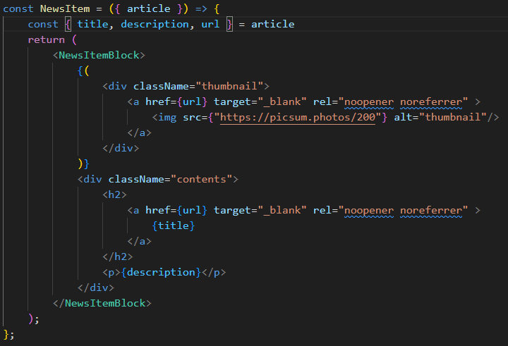
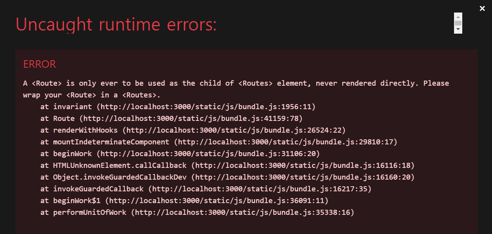

# News_Viewer
## 뉴스 뷰어 만들기

https://sycdev.tistory.com/m/entry/%ED%94%84%EB%A1%A0%ED%8A%B8%EC%95%A4%EB%93%9C-REACT-%EB%89%B4%EC%8A%A4-%EB%B7%B0%EC%96%B4-%EB%A7%8C%EB%93%A4%EA%B8%B0-1

----------------------------------------------------------------------------------------------------------------------------------------------------------------------------

## 오류 및 해결 방법
### REACT 뉴스 뷰어 만들기 [4]

- yarn-add styled-components → npm install styled-components
- [https://www.npmjs.com/package/styled-components?activeTab=versions](https://www.npmjs.com/package/styled-components?activeTab=versions)
    - 에러 내용
        
        
        
    - 해결 방법
        - styled-components version6 이후 문제 발생
        - npm install styled-components@5.3.10 명령어 사용으로 6 버전 대신 5.3.10 버전 사용
    - 참고 사이트
        - [https://luminous24.tistory.com/269](https://luminous24.tistory.com/269)- 
- NewsList.js
    - line 12 오타
        - wdith: 100% → width: 100%

----------------------------------------------------------------------------------------------------------------------------------------------------------------------------

### React 뉴스 뷰어 만들기 [5]
- NewsList.js
    - 한국 뉴스 데이터를 받아올 시
        - 아래 사진과 같이 사진과 같이 뉴스 사진과 요약 내용이 출력되지 않고 제목만 출력
    
    
    
    - 미국 뉴스 데이터를 받아올 시
        - img 태그의 src 부분에 urlToImage와 "[https://picsum.photos/200](https://picsum.photos/200)" 모두 각각 정상 작동
    - 원인
        - 뉴스 사진: NewsItem.js
    
    
            위 사진의 문제가 발생한 NewsItem
    
            
    
            수정 후의 NewsItem
    
            
    
    - 뉴스 요약본
        - 한국 뉴스 데이터를 받아올 때 요약 내용(description)의 데이터 반환 값이 null

----------------------------------------------------------------------------------------------------------------------------------------------------------------------------

### React 뉴스 뷰어 만들기 [8]
- react-router-dom 패키지 오류 (1)
    - 에러 내용
    - react-router-dom version6 이후 문제 발생
        
        
        
    - 해결 방법
        ```
        <Route />를 <Routes />로 감싸줘야 함.
        ```
    - 참고 사이트
        - [https://itprogramming119.tistory.com/entry/A-Route-is-only-ever-to-be-used-as-the-child-of-Routes-element-never-rendered-directly-Please-wrap-your-Route-in-a-Routes-해결-방법](https://itprogramming119.tistory.com/entry/A-Route-is-only-ever-to-be-used-as-the-child-of-Routes-element-never-rendered-directly-Please-wrap-your-Route-in-a-Routes-%ED%95%B4%EA%B2%B0-%EB%B0%A9%EB%B2%95)
- react-route-dom 패키지 오류 (2)
    - v6으로 변경 후 일부 코드 수정
        - App.js
            ```
            <Route> 태그의 path 속성값을 상대경로로 변경
            <Route> 태그의 component 속성을 element 속성으로 변경
            <Route> 태그의 element 속성값을 {<NewsPage />}로 변경
            ```
        - Categories.js
            ```
            <Category> 태그의 일부 속성명, 속성값 변경
            ```
    - 에러 내용
        - 카테고리를 연속해서 누르게 되면 이전처럼 메인 페이지로 돌아갔다가 이동하는 것이 아닌 그대로 중첩됨.
            
            
            
    - 해결 방법
        - Categories.js
            ```
            <Category> 태그의  to 속성값을
            {v.name === 'all' ? '/' : `${v.name}`}에서
            {v.name === 'all' ? '/' : `/${v.name}`}으로 변경
            ```
    - 참고 사이트
        - [https://velog.io/@soryeongk/ReactRouterDomV6](https://velog.io/@soryeongk/ReactRouterDomV6)
        - [https://hururuek-chapchap.tistory.com/212](https://hururuek-chapchap.tistory.com/212)
